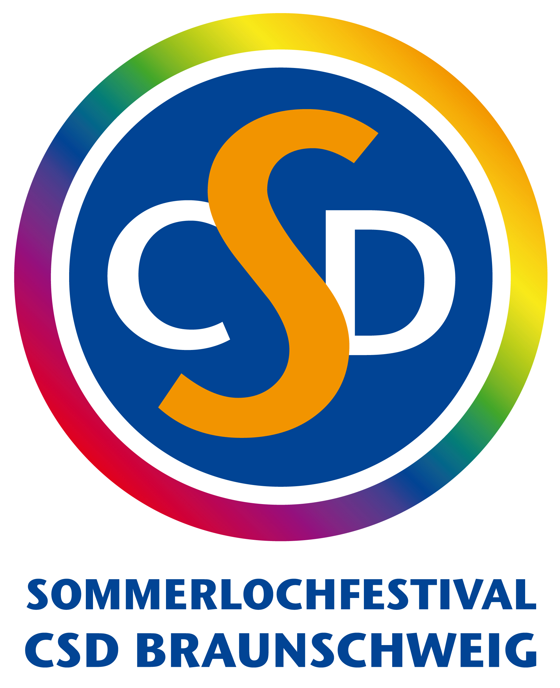

## Unser monatliches Treffen für alle Menschen im asexuellen Spektrum

### Do, 08.08.2019 um 20:00 Uhr in der [Frauenbibliothek](https://www.frauenbib-bs.de)

*Dieser Termin ist gleichzeitig ein regulärer Stammtisch und eine von [drei Veranstaltungen](/sommerloch-2019/), mit denen wir uns am [Sommerlochfestival 2019](https://csd-bs.de/) beteiligen. Wir freuen uns auf viele interessierte Besucher\*innen aus dem asexuellen Spektrum!*

Du bist asexuell, demisexuell, oder gray-ace?
Oder du bist dir noch nicht ganz sicher, aber möchtest dich einfach gerne mit anderen Menschen des asexuellen Spektrums treffen und gemeinsam über eure Erfahrungen mit einer Welt sprechen, in der Asexualität noch viel zu oft unsichtbar gemacht wird?
Dann komm vorbei und lasst uns eine große Community werden!

Wir treffen uns in den Räumen der [Frauenbibliothek](https://www.frauenbib-bs.de) an der TU. Auch wenn der Name evtl. nicht danach klingt: dort sind alle Menschen willkommen, unabhängig von Geschlecht und Alter, egal ob Studi oder nicht!

Dort gibt es gemütliche Sitzplätze, und niemand ist gezwungen, Geld für Essen und Trinken auszugeben. Ihr könnt euch gerne selbst Essen und/oder Getränke mitbringen.

Wer schon früher kommen mag: die Bibliothek hat vorher geöffnet, d.h. ihr könnt euch schon in Ruhe umschauen und ankommen. Ab 20 Uhr sind wir dann alleine dort und können die Gesprächsrunde beginnen.

Ob ihr dann einfach nur plaudern wollt oder lieber eine moderierte Diskussionsrunde, können wir zusammen jedes Mal neu entscheiden. Wir freuen uns über alle Menschen, die sich darüber freuen, hier eine Community zu finden :)
