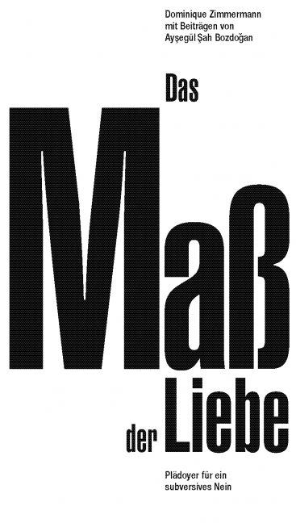
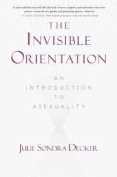

Asexualität ist zwar oft unsichtbar, aber zum Glück nicht immer - auch, was Bücher angeht. Bücher erreichen auch Menschen, die sich nicht gezielt mit Asexualität beschäftigen, und tragen so zur Verbreitung unserer Sichtbarkeit bei. Das gilt vor allem, wenn diese Bücher in Bibliotheken und Buchläden ausgestellt werden, so dass mehr Menschen darauf aufmerksam werden können. Fragt also gerne in eurer Bücherei oder dem Buchladen eures Vertrauens nach, ob sie diese Bücher vorrätig haben - das zeigt ihnen, dass sich Menschen dafür interessieren, und dass es sich lohnt, diese Bücher anzubieten!

Wir haben für euch eine Liste von Büchern zusammengestellt, in denen Asexualität vorkommt. Sie ist ganz sicher nicht vollständig - wenn ihr also ein Buch kennt, was noch nicht auf der Liste steht, [sagt uns gerne Bescheid](/kontakt/)!

In der [Frauenbibliothek Braunschweig](https://www.frauenbib-bs.de/), in der auch unser monatlicher Stammtisch stattfindet, gibt es auch einige davon auch zum Ausleihen. Wir haben diese Bücher in der Liste entsprechend gekennzeichnet.

Wir haben Bücher in deutscher und englischer Sprache aufgelistet - auf Englisch gibt es generell wesentlich mehr Bücher, in denen Asexualität vorkommt, aber wir kennen vermutlich nur einen Bruchteil davon.

---

# Bücher auf Deutsch

## Sachbücher

### Das Maß der Liebe
von [Dominique Zimmermann und Ayşegül Şah Bozdoğan](http://www.schmetterling-verlag.de/page-5_isbn-3-89657-080-3.htm)  
Schmetterling Verlag, 2015, ISBN 3-89657-080-3 (Taschenbuch)  
**Dieses Buch gibt es in der Frauenbibliothek!**  

{: .book }

**Klappentext:**  
Dominique Zimmermann möchte dazu animieren, uns selbst und andere so zu lieben, wie das tatsächlich möglich ist, sofern wir den totalitären Anspruch auf ein Ja aufgeben und durch ein subversives Nein ersetzen. Wenn das Maß der Liebe tatsächlich zu voll geworden ist, wird es Zeit, die Vielfalt an Verwechslungen, die der aufgeladene Begriff provoziert, genauer zu betrachten. Denn das, was wir Menschen üblicherweise von intimen Beziehungen erhoffen, führt nicht selten zu großem Leid und Einsamkeit, zu Streit und Eifersucht, also den Schattenseiten des positiv konnotierten Begriffs. Indem wir unsere Partner festhalten oder besitzen wollen, zerstören wir das, was eigentlich möglich ist.  
Das gilt zwar seit der Etablierung der romantischen Liebe als menschlich, ist deswegen aber noch lange nicht akzeptabel. Liebe ist kein Tauschwert, sondern eine bestimmte Energie- oder Seinsqualität, die sich in einer Vielzahl an Formen ausdrücken kann. Mit ihren Gastbeiträgen betont die Philosophin Ayşegül Şah Bozdoğan die Möglichkeit der Unterlassung, indem sie das Thema Asexualität ausführlich diskutiert und hierbei auch den Bezug zu politischen Systemen und den neusten Entwicklungen in ihrer Heimatstadt Istanbul nicht scheut.  
Das Buch nähert sich dem Themenbereich unter philosophischen, psychologischen, soziologischen, literarischen und mystischen Gesichtspunkten, behält aber dank der Arbeit von Dominique Zimmermann als Beraterin in einer Condomeria die Alltagswirklichkeit einer größeren Bevölkerungsschicht im Auge und leitet die Lesenden mit einer Prise Humor durch die Lektüre.

**Bewertung (von Kirstin):**   
Eine philosophische Abhandlung über die Liebe und die vielen (oft unsinnigen) Normen, die in unserer Kultur mit ihr verknüpft sind. Die Allo- und Mononormativität der Gesellschaft wird ausführlich auseinandergenommen und es wird erklärt, warum sowohl Asexualität als auch Polyamorie in dieser Kultur subversiv sind. Die Sprache des Buchs ist leider recht sperrig (wie vermutlich bei Philosophinnen so üblich?), aber der Inhalt ist durchaus interessant für alle, die sich von der Sprache nicht abschrecken lassen.

### Geschlechtliche, sexuelle und reproduktive Selbstbestimmung
von Michaela Katzer, Heinz-Jürgen Voß (Hg.)  
Mit Texten von Nadine Schlag, Andrzej Profus, u.a.  
[Psychosozial Verlag](https://www.psychosozial-verlag.de/catalog/product_info.php/products_id/2546), 2016, ISBN 987-3-8379-2546-3 (Taschenbuch)  
(auch als e-book verfügbar - [kostenloser Download](https://www.psychosozial-verlag.de/6799))  
**Dieses Buch gibt es in der Frauenbibliothek!**  

{: .book }

Das Buch ist eine Sammlung von Texten verschiedener Autor\*innen, darunter auch zwei Texte zum Thema Asexualität (Zusammenfassungen von Kirstin):

**Nadine Schlag: Asexualität, Eine diskursive Annäherung**  

Der Text gibt einen Überblick über verschiedene Aspekte des Themas. Zuerst wird das  Selbstverständnis von asexuellen Menschen betrachtet, und dann ein recht ausführlicher Blick auf die Pathologisierung geworfen, der asexuelle Menschen in klinischen Kontexten ausgesetzt sind, und wie sich das historisch entwickelt hat. Nach dieser harten Kost gibt es dann noch eine hoffnungsvollere Sicht darauf, wie das Verhältnis der Sexualwissenschaft zur asexuellen Community sein könnte, und welche Fallstricke dabei zu beachten sind.

**Andrzej Profus: Unsichtbares sichtbar machen, Asexualität als sexuelle Orienteirung**

In diesem Text wird zunächst beschrieben, wie groß und vielfältig das asexuelle Spektrum ist, und die wichtigsten Grundbegriffe erkärt. Dann folgt eine Auseinandersetzung mit den gängigen Vorurteilen und Diskriminierungsformen, die asexuelle Menschen häufig erleben. Auch auf die Konzepte des aromantischen Spektrums wird eingegangen.  
Der Text deckt viele wichtige Bereiche und Fragen ab - wobei der dargestelle Wissensstand von 2016 in einigen Jahren wahrscheinlich schon veraltet erscheinen wird, da sich in dieser jungen Community aktuell (Stand: Ende 2019) noch vieles weiterentwickelt.

(Auf die anderen 14 Texte des Buchs gehe ich an dieser Stelle nicht ein, da sie nicht von Asexualität handeln und das den Rahmen dieser Liste sprengen würde. Die Qualität der Texte ist unterschiedlich und ich überlasse es anderen Menschen, sie zu bewerten.)

## Romane, Kurzgeschichten, etc.

### Perfect Rhythm - Herzen im Einklang  
von [Jae](https://jae-fiction.de/perfect-rhythm/)  
Ylva Verlag, 2017, ISBN 978-3-95533-906-7 (Taschenbuch)  
(auch als e-book verfügbar)  
**Dieses Buch gibt es in der Frauenbibliothek!**  

{: .book }

**Klappentext:**  
Popstar Leontyne Blake singt über die Liebe, doch eigentlich hat sie schon vor langer Zeit aufgehört, daran zu glauben. Frauen geht es immer nur um ihr Geld oder ihre Berühmtheit, nicht um sie selbst.  
Als ihr Vater einen Schlaganfall erleidet, kehrt sie in die Kleinstadt zurück, in der sie aufgewachsen ist.  
Dort lernt sie die Krankenschwester Holly Drummond kennen, die sich nicht von Leos Berühmtheit beeindrucken lässt. Das ist nicht das Einzige, was Holly von anderen Frauen unterscheidet. Sie ist asexuell und hat die Suche nach einer Partnerin aufgegeben.  
Kann mehr werden aus der zaghaften Freundschaft zwischen einer ausgebrannten Popsängerin und einer Frau, die kein Interesse an Sex hat?

*Perfect Rhythm – Herzen im Einklang* ist ein lesbischer Liebesroman über die Suche nach dem harmonischen Einklang zwischen zwei sehr verschiedenen Menschen.

**Bewertung (von Kirstin):**   
Ein sehr süßer (monoamorer) Liebesroman, in dem viele Hintergrundinfos über Asexualität geschickt in die Handlung eingebaut sind. Sehr gut recherchiert und sympathisch menschlich beschriebene Charaktere. Ich empfehle das Buch gerne weiter!

[Hier gibt es ein Interview mit der Autorin dazu.](https://ylva-verlag.de/jae-perfect-rhythm-lesbisch-asexuell-interview/)

Übrigens gibt es dieses Buch auch auf Englisch, es wurde von der Autorin selbst auf Deutsch übersetzt. (siehe unten)

### Nur in der Dunkelheit leuchten die Sterne 
von [Marieke Nijkamp](https://www.fischerverlage.de/autor/marieke_nijkamp/a2496611)  
Fischer Verlag, 2018, ISBN 978-3-8414-4026-6 (Taschenbuch)  
(auch als e-book verfügbar)  
**Dieses Buch gibt es in der Frauenbibliothek!**  

{: .book }

**Klappentext:**  
Corey und Kyra waren beste Freundinnen, unzertrennlich in ihrer schneebedeckten Heimatstadt Lost Creek. Als Corey wegzieht, nimmt sie Kyra das Versprechen ab, stark zu bleiben während des langen, dunklen Winters und auf ihren Besuch in den Weihnachtsferien zu warten.  
Kurz bevor Corey nach Hause kommen soll, erhält sie die Nachricht, dass Kyra tot ist. Corey ist am Boden zerstört – und verwirrt. Alle in der Stadt sprechen nur im Flüsterton über die verlorene Tochter, sagen, dass ihr Tod vorherbestimmt gewesen sei. Und sie behandeln Corey wie eine Fremde.  
Corey weiß, dass etwas nicht stimmt. Mit jeder Stunde wächst ihr Verdacht. Lost hat Geheimnisse – aber die Wahrheit darüber herauszufinden, was mit ihrer besten Freundin passiert ist, könnte sich als ebenso schwierig erweisen, wie den Himmel in einem Alaska-Winter zu erhellen.

Der neue Roman der internationalen Bestsellerautorin Marieke Nijkamp!

**Bewertung (von Kirstin):**   
Ein spannendes Buch, bei dem ich als Leserin bis zum Ende mitgefiebert habe. Die asexuelle Orientierung eines Hauptcharakters wird explizit benannt (juhu für mehr Sichtbarkeit!) - und ist dabei weder der Dreh- und Angelpunkt der Handlung, noch ein zusammenhanglos eingestreuter Fakt, sondern eines von vielen Details, was eben in einigen Situationen wichtig ist, um die Gedankenwelt des Charakters zu verstehen.  
Damit ist dieses Buch ein gutes Beispiel dafür, Asexualität als selbstverständichen Teil der Vielfalt dieser Welt abzubilden: nicht alle unsere Geschichten drehen sich um unsere sexuelle Orientierung, aber trotzdem ist sie ein Teil unserer Persönlichkeit, der unser Leben an vielen Stellen beeinflusst.

---

# Books in English

## Non-Fiction

###The Invisible Orientation – an Introduction to Asexuality  
by [Julie Sondra Decker](http://juliesondradecker.com/?page_id=1767)  
Skyhorse Publishing/Carrel Books, 2014, ISBN 978-1-63450-243-6 (paperback)  
(also available as harcover, e-book, audio, etc.)  
**This book is available at the Frauenbibliothek!**  

{: .book }

**Blurb:**  
A growing number of people are identifying as asexual. They aren’t sexually attracted to anyone, and they consider it a sexual orientation—like gay, straight, or bisexual.

Asexuality is the invisible orientation. Most people believe that “everyone” wants sex, that “everyone” understands what it means to be attracted to other people, and that “everyone” wants to date and mate. But that’s where asexual people are left out—they don’t find other people sexually attractive, and if and when they say so, they are very rarely treated as though that’s okay.

When an asexual person comes out, alarming reactions regularly follow; loved ones fear that an asexual person is sick, or psychologically warped, or suffering from abuse. Critics confront asexual people with accusations of following a fad, hiding homosexuality, or making excuses for romantic failures. And all of this contributes to a discouraging master narrative: there is no such thing as “asexual.” Being an asexual person is a lie or an illness, and it needs to be fixed.

In *The Invisible Orientation*, Julie Sondra Decker outlines what asexuality is, counters misconceptions, provides resources, and puts asexual people’s experiences in context as they move through a very sexualized world. It includes information for asexual people to help understand their orientation and what it means for their relationships, as well as tips and facts for those who want to understand their asexual friends and loved ones.

**Review (by Kirstin):**  
This is the first book aimed at non-professional readers, as far as I know, that gives a good overview about the topic of asexuality. It provides a basic introduction into the subject, as well as common misconceptions and problems. As there are still so many people who have never even heard about asexuality, this book is a very useful resource and I would recommend it to anyone who wants to start learning about asexuality.  

It has been translated into Japanese, but not yet into German (as of summer 2019). I hope that there will be a german translation someday.

## Fiction

### Perfect Rhythm  
by [Jae](https://ylva-verlag.de/buecher/perfect-rhythm/)  
Ylva Verlag, 2017, ISBN 978-3-95533-862-6 (paperback)  
(also available as e-book)  

{: .book }

**Blurb:**  
Pop star Leontyne Blake might sing about love, but she stopped believing in it a long time ago. What women want is her image, not the real her. When her father has a stroke, she flees the spotlight and returns to her tiny Missouri hometown.  
In her childhood home, she meets small-town nurse Holly Drummond, who isn’t impressed by Leo’s fame at all. That isn’t the only thing that makes Holly different from other women. She’s also asexual. For her, dating is a minefield of expectations that she has decided to avoid.  
Can the tentative friendship between a burned-out pop star and a woman not interested in sex develop into something more despite their diverse expectations?  

A lesbian romance about seeking the perfect rhythm between two very different people – and finding happiness where they least expect it.

**Review (by Kirstin):**  
A very cute (monoamorous) romance novel with a lot of background info about asexuality, artfully woven into the story. Very well researched, and the characters are sweet and relatable. I recommend this book a lot!

This book is also available in german (I read the german version), translated by the author herself (see above).

<!--
### Chameleon Moon
by RoAnna Sylver

### Unburied Fables
collection of short stories by various authors 
-->
