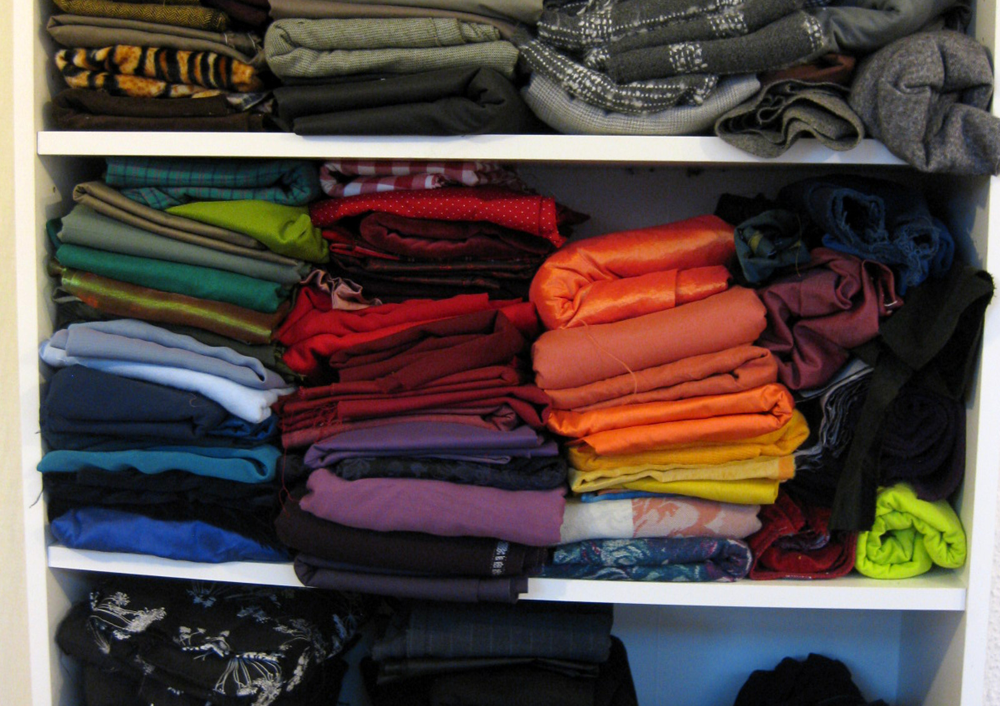

##Warum lohnt es sich, Kleidung auf Maß anzufertigen?

Gut sitzende Kleidung ist in der Zeit der industriellen Massenproduktion schon fast zu einer seltenen Ausnahme geworden. Dabei verspricht ein individuell angepasstes Kleidungsstück nicht nur mehr Tragekomfort, sondern lässt die Menschen, die es tragen, auch besser aussehen. Es unterstreicht die persönlichen Vorzüge, und wer sich in seiner "zweiten Haut" wohlfühlt, strahlt dies auch nach außen hin aus.

Kostüme und Mode aus dem Atelier Sonnenschein werden dir nach deinen persönlichen Maßen "auf den Leib" geschneidert. Zusätzlich zu einer ausgezeichneten Passform erhältst du damit ein hochwertiges Unikat, das nach deinen individuellen Wünschen entworfen und gefertigt wurde.  
Lass dich von mir persönlich beraten und wähle ein einzigartiges Design und eine große Vielfalt hochwertiger Materialien. 

##Kann ich bei dir auch Schnittmuster zum Selbernähen kaufen?

Ja, ich erstelle auf Wunsch gerne ein Schnittmuster nach deinen Maßen. Egal ob als Modellschnitt für einen besonderen Entwurf oder als Grundschnitt, den du selbst immer wieder abwandeln kannst - ein gut sitzendes Schnittmuster ist eine wertvolle Grundlage für kreative Hobbyschneider*innen.  
Ein Schnittmuster kostet je nach Aufwand ungefähr 15€ bis 50€.

Und wenn du dazu mal Profi-Unterstützung beim Nähen brauchst, dann kannst du mich gerne für einen Nähkurs buchen.

##Muss/darf ich die Stoffe für meine Gewandung selber mitbringen?

Musst du nicht - darfst du aber gerne! Wenn du schon passende Stoffe für deine Wunschgewandung gefunden hast, freue ich mich darüber, wenn du sie mitbringst. Wenn du noch nichts Passendes gefunden hast, kannst du dir aus meinen vorrätigen Stoffen welche aussuchen, oder ich suche bei meinen Lieferanten nach etwas, was dir gefällt.

##Wie lange dauert es, eine Gewandung bei dir anfertigen zu lassen?

Das kann sehr unterschiedlich sein (von einem Tag bis zu mehreren Monaten) und hängt von verschiedenen Dingen ab: zum Beispiel, wieviele wie dringende andere Aufträge ich gerade habe, wann du Zeit für Anproben hast, und welche Materialien erst noch besorgt werden müssen. Oft dauert die Materialbeschaffung am längsten - wenn du also einen sehr kurzfristigen Auftrag hast, dann klappt das am besten, wenn du die gewünschten Stoffe entweder schon selbst mitbringst oder aus meinem Vorrat aussuchst, und außerdem jederzeit spontan zu Anproben kommen kannst.

##Wieviel kostet es, eine Gewandung bei dir anfertigen zu lassen?

Der Preis richtet sich nach dem Arbeitsaufwand und dem Materialverbrauch. Oft macht ein kleines Detail (z.B. die Anzahl der Knopflöcher, oder eine Stickerei) schon einen relativ großen Unterschied im Preis aus, deswegen lässt sich das nicht allgemein beantworten, bevor ich einen genauen Entwurf habe. Den ganz genauen Preis kann ich auch dann immer erst im Nachhinein angeben - ich weiß ja vorher nicht genau, wieviele Stunden Arbeitszeit ich für einen Auftrag brauchen werde. Damit du besser kalkulieren kannst, versuche ich aber immer, vorher eine Schätzung abzugeben (auf der Basis von ähnlichen Stücken, die ich bereits verkauft habe).  
Zur groben Orientierung: die meisten Gewandungen, die ich bisher angefertigt habe, haben zwischen 200€ und 1000€ gekostet.

##Ich bin Cosplayer. Kannst du mir ein Kostüm meines liebsten Film-/Spiele-/Seriencharakters anfertigen?

Normalerweise nicht einfach so. Da die Designs für Filmkostüme etc. dem Urheberrecht unterliegen, brauche ich eine Lizenz des Rechteinhabers, um ein Kleidungsstück verkaufen zu dürfen, was nach dessen Entwurf angefertigt wurde.  
Ausnahmen sind Kleidungsstücke, die eher "alltäglich" sind und daher nicht einem speziellen Designer zuzuordnen. Wenn dein Lieblingscharakter also z.B. mit Jeans und T-shirt rumläuft oder mit einer schlichten Tunika, dann ist das kein Problem. Wenn das Design von mir deutlich abgewandelt wird, ist es auch kein Problem mehr, das wäre allerdings für Cosplay ja meist nicht der Sinn der Sache. Eventuell kannst du ein schlichtes maßgeschneidertes Kleidungsstück aber auch selber noch mit den passenden Details zum Cosplay verwandeln.

Falls du einen selbst erfundenen Charakter cosplayen möchtest, ist das natürlich kein Problem. Bei anderen Charakteren kannst du ggf. auch versuchen, eine Genehmigung des Rechteinhabers zu bekommen.

Außerdem kann ich dich gerne beraten, wenn du dein Cosplay selber nähen möchtest. Mit einem maßgefertigten Schnittmuster und fachkundiger Beratung geht das Selber-Nähen schon viel leichter.

##Ich suche eine Praktikums-/Ausbildungs-/Arbeitsstelle. Wie kann ich mich bei dir bewerben?

Ich arbeite in meiner kleinen Werkstatt alleine. Dadurch werde ich zwar nie eine große Firma werden, aber es ist mir wichtiger, dass ich meine Arbeitszeit frei einteilen kann, und mir keine Sorgen darum machen muss, ob ich mir bei schwankender Auftragslage überhaupt Angestellte leisten kann. Deswegen ist meine Ausstattung hier nicht für mehrere Personen ausgelegt, und ich kann weder eine Festanstellung noch einen Ausbildungs- oder Praktikumsplatz vergeben. Ich wünsche dir viel Glück bei deiner weiteren Suche.
