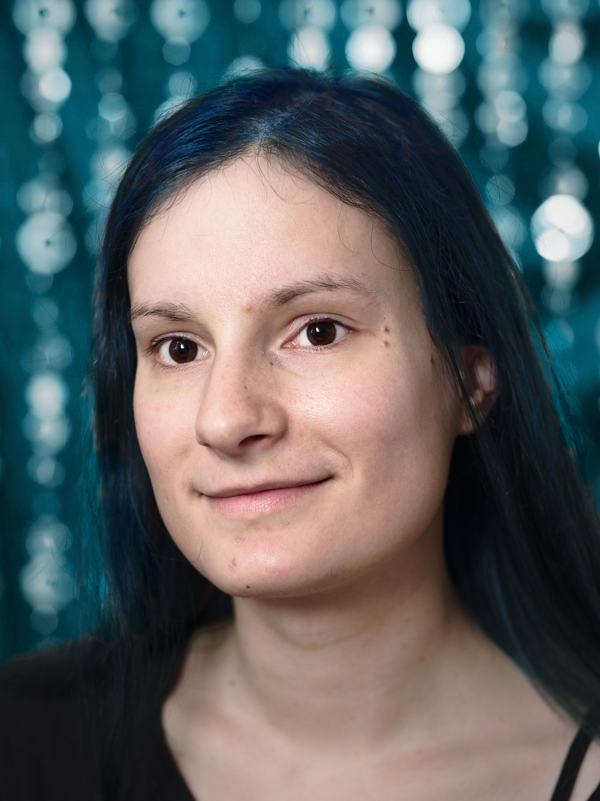
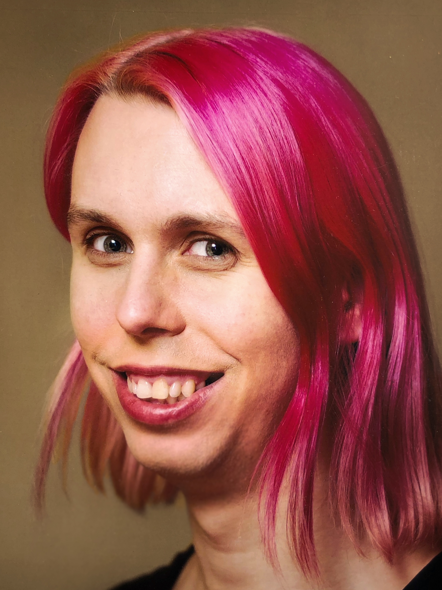

- [Wer seid ihr?](#werseidihr)
- [Warum gibt es die Amazing Aces?](#warum)
- [Wer organisiert das?](#orga)
- [Wieviele Leute seid ihr?](#wieviele)
- [Sind immer die gleichen Leute da?](#diegleichenleute)
- [Wo kann ich euch vorher online kennenlernen oder mich mit anderen Leuten absprechen, die auch dabei sein werden?](#socialmedia)
- [Was passiert bei so einem Stammtisch?](#waspassiert)
- [Redet ihr nur über Asexualität?](#thema)
- [Was macht ihr sonst noch, außer Reden?](#wassonst)
- [Ich bin nicht sicher, ob ich ins asexuelle Spektrum passe, darf ich trotzdem kommen?](#nichtsicher)
- [Ich bin nicht asexuell, aber möchte mich über das Ace-Spektrum informieren (z.B. weil mein\*e Partner\*in asexuell ist), darf ich trotzdem kommen?](#nichtace)
- [Wo findet der Stammtisch statt?](#wo)
- [Muss ich da etwas zu essen oder trinken kaufen?](#essen)
- [Ist der Zugang zum Stammtisch rollstuhlgerecht?](#rollstuhl)
- [Wann findet der Stammtisch statt?](#wann)

##Wer seid ihr?

Wir sind eine Community für Menschen in Braunschweig und Umgebung, die sich im [asexuellen Spektrum](/das-asexuelle-spektrum/) identifizieren. Wer selbst im Ace-Spektrum ist (oder vermutet, vielleicht im Ace-Spektrum zu sein), kann zu unserem Stammtisch kommen. Und wer sich über das asexuelle Spektrum informieren möchte, findet dazu Infos auf unserer Website.

([nach oben](#top))

##Warum gibt es die Amazing Aces?

Asexualität ist in unserer Kultur oft unsichtbar. Viele Asexuelle denken, sie seien die Einzigen, denen es so geht, und fürchten, dass etwas mit ihnen nicht in Ordnung sei. Erfahrungsaustausch mit anderen Asexuellen ist hilfreich, um zu erkennen, dass Asexualität häufiger ist als vermutet und genauso in Ordnung ist, wie alle anderen sexuellen Orientierungen auch.

Deshalb wollen wir einen Raum schaffen, in dem wir uns mit anderen Menschen des asexuellen Spektrums austauschen können, und haben dafür im Oktober 2017 einen regelmäßigen Stammtisch ins Leben gerufen.

([nach oben](#top))

##Wer organisiert das?

Der Stammtisch wurde von **Kirstin** und **Lena** gegründet. Wir sorgen dafür, dass die Termine auf dieser Website und an anderen Orten angekündigt werden, und sind auch für euch [ansprechbar](/kontakt/), falls ihr Fragen habt.  
Wenn ihr Ideen habt, könnt ihr die auch gerne einbringen, wir bieten euch nur den Rahmen, der von euch mit Inhalten gefüllt werden kann.

**Kirstin:** *Ich wurde 1987 geboren und verstehe mich seit 2015 als asexuell und bi-/panromantisch. Außerdem lebe ich polyamor. Ich bin selbständig als Schneidermeisterin und studiere Informatik an der TU Braunschweig.*  
*Ich habe die Amazing Aces mitgegründet, weil mir die Sichtbarkeit von Asexualität wichtig ist (hätte ich mehr darüber gewusst, wäre mein Coming-out sicherlich früher und einfacher gewesen). Außerdem möchte ich eine Community schaffen, in der wir Aces uns nicht als Außenseiter\*innen fühlen müssen und uns mit unseren Erfahrungen gegenseitig unterstützen können.*

 

**Lena:** *Ich wurde 1984 geboren und bin lesbisch, trans, polyamor und im asexuellen Spektrum. Wo ich mich dort genau einordne, hat sich schon ein paar mal geändert und ist auch jetzt noch im Fluss. Ich bin Software-Entwicklerin und mache hier und da ein bisschen queeren Aktivismus im kleinen Stil.*  
*Ich habe die Amazing Aces mitgegründet, weil ich in anderen Kontexten bereits erlebt habe, wie wertvoll es sein kann, sich mit Menschen in einer ähnlichen Lebenssituation auszutauschen. Dabei habe ich einen deutlich kleineren Anteil an der Organisation als Kirstin.*

([nach oben](#top))

##Wieviele Leute seid ihr?

Beim Stammtisch sind wir bisher (Stand: Frühling 2019) oft eher eine kleine Gruppe, meistens zwischen drei und sieben Leute. Wir freuen uns immer über neue Gesichter :)

([nach oben](#top))

##Sind immer die gleichen Leute da?

Normalerweise ist immer mindestens eine von uns Organisatorinnen da, meistens beide - ansonsten gibt es ein paar Menschen, die oft da sind, aber nicht jedes Mal. Und einige, die eher selten da sind, oder auch nur einmal da waren. Wir freuen uns immer über neue Teilnehmer*innen.

([nach oben](#top))

##Wo kann ich euch vorher online kennenlernen oder mich mit anderen Leuten absprechen, die auch dabei sein werden?

Da gibt es mehrere Möglichkeiten: 

- Zu jedem Stammtisch-Termin erstellen wir auch eine Veranstaltung auf [Facebook](https://facebook.com/AmazingAcesBS). Dort kannst du dich als Teilnehmer\*in oder als Interessiert eintragen und mit anderen Teilnehmer\*innen interagieren. Es sind aber nicht alle Leute, die zu unserem Stammtisch kommen, auch bei Facebook aktiv.
- Du kannst uns auf [Twitter](https://twitter.com/AmazingAcesBS) folgen. Auch da veröffentlichen wir zu jedem Termin einen Ankündigungstweet und du kannst dort kommentieren oder uns in deinem Tweet erwähnen, um andere Teilnehmer\*innen zu finden.
- Wenn du eine konkrete Frage hast, kannst du uns Organisatorinnen auch eine [E-mail](/kontakt/) schreiben - wir können die Frage ggf. auch per E-mail an die Leute weiterleiten, die unsere Termin-Erinnerungen und Nachrichten abonniert haben.
- Wir denken gerade darüber nach, eine Plattform (oder auch mehrere) einzurichten, auf der sich alle Teilnehmer\*innen und Interessierten online austauschen können. Das könnte z.B. eine Mailingliste sein, oder eine Gruppe in einem Messenger wie Signal, Whatsapp oder Telegram. Wenn ihr gerne bei einem davon mit dabei sein möchtet, [sagt uns Bescheid](/kontakt/)!

([nach oben](#top))

##Was passiert denn bei so einem Stammtisch?

Meistens sitzen wir gemütlich in einer Runde auf den Sofas und unterhalten uns, manchmal haben wir dabei auch etwas zu Essen und zu Trinken (falls jemand etwas mitbringt, und es gibt einen Wasserkocher vor Ort). 
Wenn neue Leute dabei sind, machen wir am Anfang meistens eine kurze Vorstellungsrunde.

([nach oben](#top))

##Redet ihr nur über Asexualität?

Manchmal reden wir viel über Themen, die mit Asexualität zu tun haben. 
Z.B. erzählen wir von unseren Coming-out-Erfahrungen oder unterhalten uns über Bücher, in denen Asexualität vorkommt, etc.  
Und manchmal reden wir einfach über irgendwas ganz anderes, was uns gerade interessiert - um eine angenehme Community aufzubauen und uns besser kennenzulernen.  
Welche Gesprächsthemen es an einem bestimmten Abend gibt, hängt davon ab, was die anwesenden Leute gerade besprechen wollen. Wir sind immer offen für Vorschläge.

([nach oben](#top))

##Was macht ihr sonst noch, außer Reden?

Wir haben Tassen und einen Wasserkocher vor Ort und trinken oft Tee. Manchmal bringt auch jemand etwas zu essen mit. Ansonsten ist der Stammtisch schon hauptsächlich zum Reden gedacht. 

Wir könnten uns auch vorstellen, andere Sachen zu machen, wie z.B. zusammen einen Film gucken, Brettspiele spielen, Demo-Schilder für den CSD basteln, oder was auch immer euch so einfällt - allerdings würden wir das vorher ankündigen und ggf. einen extra-Termin dafür suchen, damit der eigentliche Stammtisch einfach eine Gesprächsrunde bleiben darf.

([nach oben](#top))

##Ich bin mir nicht sicher, ob ich ins asexuelle Spektrum passe. Darf ich trotzdem dabei sein?

Ja, auch wenn du dir nicht sicher bist, bist du bei uns herzlich willkommen - vielleicht hilft der Austausch mit anderen Aces ja sogar dabei, etwas über dich selbst zu lernen.

([nach oben](#top))

##Ich bin selbst nicht asexuell, aber ich möchte mich über Asexualität informieren, z.B. weil ich vermute, dass mein\*e Partner\*in asexuell ist. Darf ich auch dabei sein?

Das ist so allgemein schwierig zu beantworten. In erster Linie ist der Stammtisch ein Ort für uns Asexuelle (und Leute, die unsicher sind, ob sie asexuell sind) selbst, aber wir können uns auch sinnvolle Ausnahmen vorstellen. Am besten schreibst du uns eine E-mail und erklärst deine Situation, dann können wir überlegen ob es passt, wenn du beim Stammtisch dabei bist.

([nach oben](#top))

##Wo findet das Treffen statt?

Wir treffen uns im Raum der [Frauenbibliothek](https://www.frauenbib-bs.de/) an der TU Braunschweig, Zimmerstraße 24D. Der Raum ist im ersten Stock (es gibt leider keinen Aufzug). Auch wenn der Name es vielleicht nicht vermuten lässt, sind dort alle Menschen willkommen -  unabhängig von Geschlecht und Alter, egal ob Studi oder nicht.

Dort gibt es gemütliche Sitzgelegenheiten und wir sind ab 20 Uhr ungestört. Vorher hat die Bibliothek geöffnet - wenn ihr schon früher da sein möchtet, könnt ihr euch also schonmal umschauen und es euch gemütlich machen.

([nach oben](#top))

##Muss ich da etwas zu essen oder trinken kaufen?

Essen und Getränke dürft ihr euch gerne selbst mitbringen, wenn ihr mögt. Wir haben einen Wasserkocher, Tassen und Gläser.  
Es gibt in der Frauenbibliothek nichts zu kaufen, ihr seid also auch nicht verpflichtet, Geld auszugeben.

([nach oben](#top))

##Ist der Zugang zum Stammtisch rollstuhlgerecht?

Derzeit leider nicht, da der Raum im ersten Stock liegt und das Gebäude keinen Aufzug hat. Das tut uns sehr leid und wir sind offen für Vorschläge, welchen anderen Raum wir für den Stammtisch nutzen könnten, der in dieser Hinsicht besser ist.

([nach oben](#top))

##Wann findet der Stammtisch statt?

Üblicherweise am zweiten Donnerstag des Monats um 20 Uhr. Die [aktuellen Termine](/termine/) findet ihr auch immer hier auf der Website, falls sich mal etwas ändert oder das Treffen z.B. wegen eines Feiertags ausfällt oder an einem anderen Ort stattfindet.  
Wenn du an die Termine erinnert werden möchtest, gib uns gerne deine E-mail-Adresse. Wir schicken immer ein paar Tage vor dem nächsten Termin eine Erinnerungsmail an alle, die das möchten.

Falls dir der Termin am Donnerstag Abend generell nicht passt, aber du eigentlich gerne dabei sein möchtest, dann freuen wir uns über eine [Rückmeldung](/kontakt/) dazu - falls viele Leute lieber einen anderen Termin hätten, können wir dann überlegen, wann ein besserer Zeitpunkt wäre.

([nach oben](#top))
