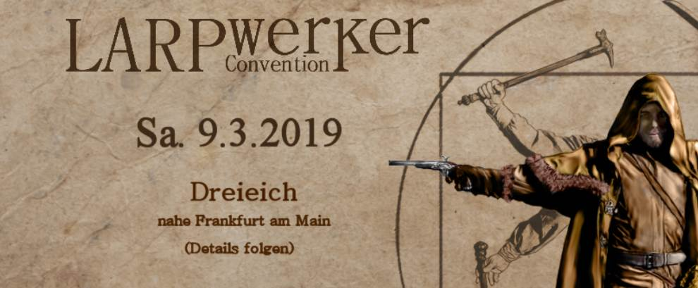

##LARPwerker Convention 2019

Wie schon in den letzten Jahren, werde ich auch 2019 wieder mit einem Stand auf der [**LARPwerker Convention**](http://www.larpwerker-convention.de/) in den Bürgerhäusern in Dreieich (bei Frankfurt/Main) sein.

Für alle von euch, die gerne persönlich über ihre Wünsche für die neue Gewandung sprechen wollen, aber näher an Dreieich als an Braunschweig wohnen, also eine praktische Gelegenheit!

Ich werde dort, wie üblich, einen kleinen Stand aufbauen - mit einigen Ausstellungsstücken, Bildern und Fotoalben zum Stöbern und Inspirieren lassen.
Eventuell werde ich auch einige Waren (z.B. kleine Accessoires) zum Verkauf vor Ort dabei haben.

Und ihr könnt natürlich mit mir über eure Gewandungswünsche sprechen - Stifte und Skizzenblock sind immer dabei, genauso wie Maßband und Maßtabellen für alle Kurzentschlossenen, die auch gleich ausgemessen werden möchten.
