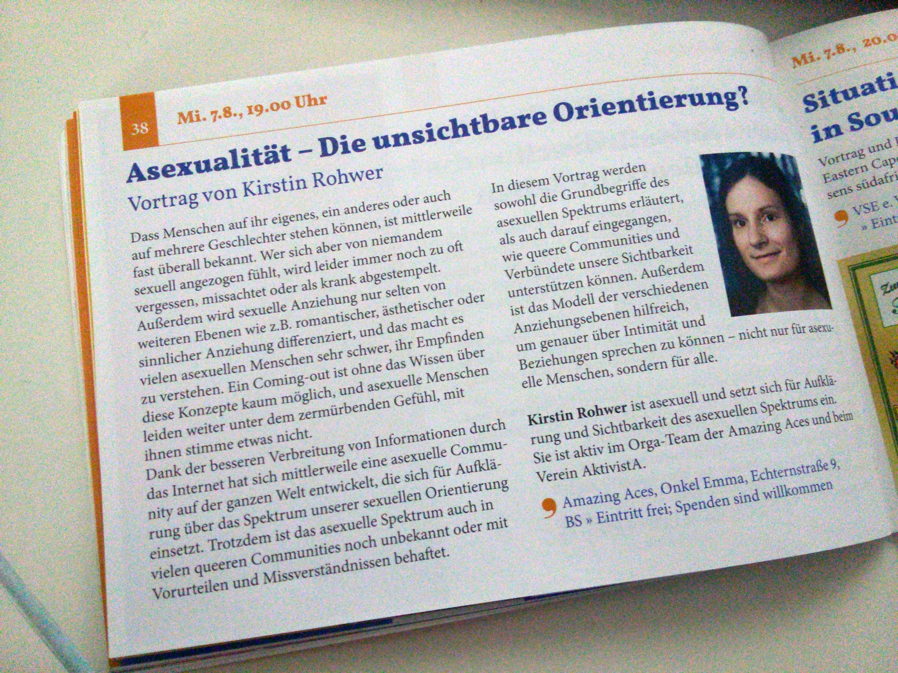
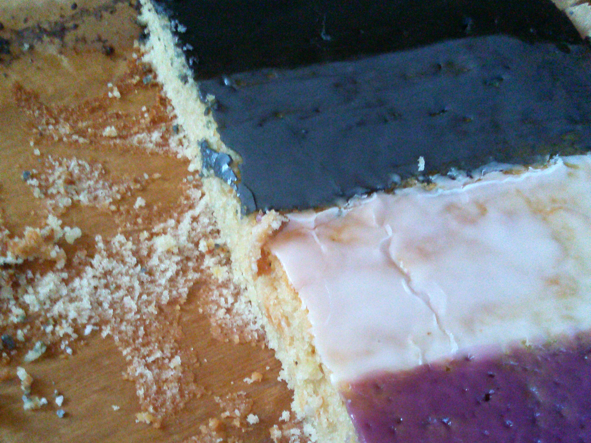
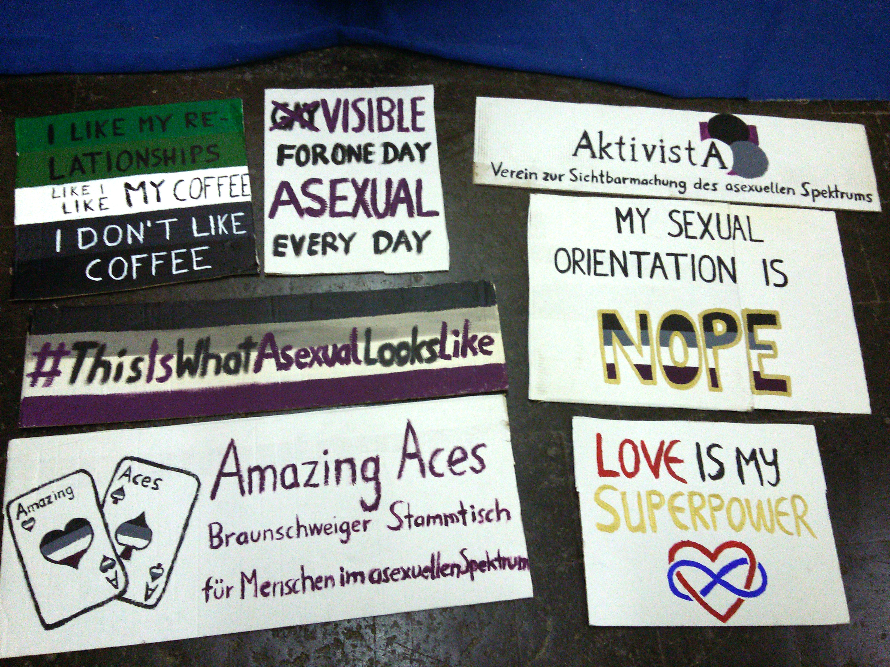
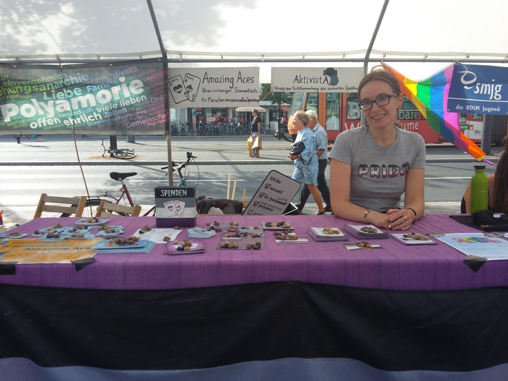
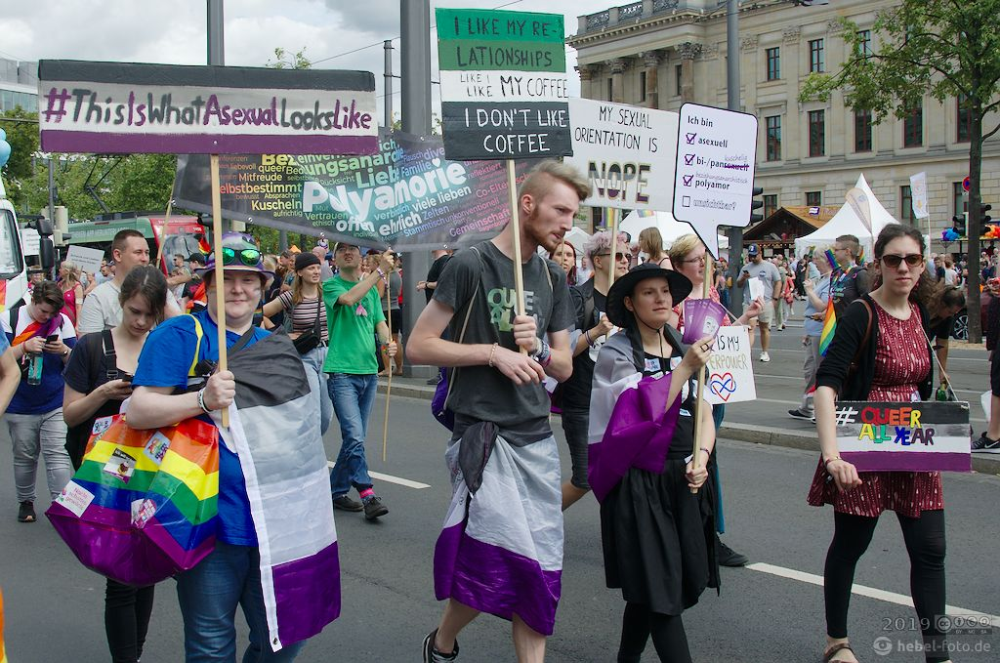

Nun ist sie vorbei, die Braunschweiger CSD-Saison mit dem [Sommerlochfestival 2019](https://www.csd-braunschweig.de/programm-2019/). Wir Amazing Aces waren diesmal auf vielfältige Weise mit dabei und blicken auf ein buntes Programm zurück.

Im Vorfeld haben wir uns zuerst [über das unglücklich gewählte Motto gewundert](/queer-all-year/), und uns über die Initiative *Queer all Year* gefreut, die viele Gruppen zusammengebracht hat, die sonst unter diesem Motto unsichtbar geblieben wären.

Entgegen dem Anschein, den das Motto machte, war das Rahmenprogramm zum Glück trotzdem sehr vielfältig, und auch wir konnten uns gleich mehrfach daran beteiligen.

Den Anfang machte dabei unsere Organisatorin Kirstin am Mittwoch, den 7.8.2019, mit einem [Vortrag im queeren Zentrum Onkel Emma](/vortrag-sommerloch-2019/), bei dem das Publikum einen Überblick über die Grundbegriffe des asexuellen Spektrums, das *split attraction model*, und die Schwierigkeiten asexueller Menschen im Alltag unserer Kultur bekam.
 

Der Vortrag war mit ca. 30 Zuschauenden so gut besucht, dass die Sitzplätze mit gutem Blick auf die "Leinwand" im Onkel Emma schon sehr knapp wurden.

Der Vortrag wurde auf Video aufgezeichnet. Falls ihr also nicht dabei sein konntet, könnt ihr ihn jetzt [hier](https://www.youtube.com/watch?v=etlFeVXdJMI) nachhören:

<%= youtube("etlFeVXdJMI") %>

Direkt am folgenden Tag fand dann unser monatlicher [Stammtisch](/2019-08-stammtisch/) statt, der ebenfalls im Sommerlochfestival-Programmheft angekündigt wurde. Dort haben wir zur Feier des Tages – und um unserem Klischee gerecht zu werden ;) – erstmal einen Kuchen gegessen. 

Danach wurden dann fleißig die Pinsel geschwungen und wir haben Schilder für den bevorstehenden CSD gemalt.

Am Samstag fand dann nicht nur die große CSD-Demo statt, sondern auch das Straßenfest auf dem Schlossplatz. Dafür hatten wir gemeinsam mit dem Verein [AktivistA](http://aktivista.net) einen Infostand vorbereitet, und waren schon vor der Parade auf dem Platz, um den Stand aufzubauen. 

Unser Info-Material sowie die Sticker und Buttons erfreuten sich großer Beliebtheit, und wir haben viele asexuelle Pride-Flaggen gesehen, die es erfreulicherweise auch an einem Stand auf dem Straßenfest zu kaufen gab. 

Es gibt auch schon einen ausführlichen [Bericht mit Bildern auf der Website von AktivistA](https://aktivista.net/2019/08/11/frischer-wind-auf-dem-csd-braunschweig/).

Auch bei der CSD-Parade waren wir diesmal mit unseren Flaggen und Schildern gut zu sehen. Wir freuen uns schon aufs nächste Mal!

{:target='_blank'}

(Foto von [hebel-foto.de](http://hebel-foto.de/), [CC BY-NC-SA 3.0](http://creativecommons.org/licenses/by-nc-sa/3.0/de/deed.de))
