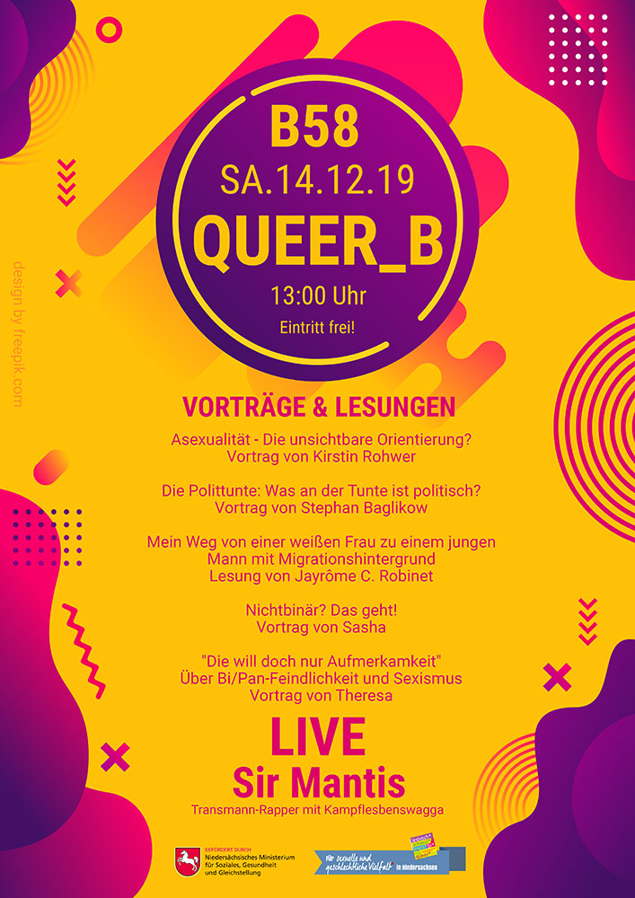

## Die unsichtbare Orientierung? - Vortrag von Kirstin Rohwer

### Sa, 14.12.2019 um 13:30 Uhr im [B58 Braunschweig](http://juzb58.de/)

*Im Rahmen des Veranstaltungstages **Queer_B** hält Kirstin (Organisatorin der Amazing Aces) einen Vortrag über das Thema Asexualität. Außerdem gibt es an diesem Tag noch weitere spannende Vorträge, Lesungen, etc. aus dem queeren Themenbereich.* 

### Beschreibung zum Vortrag:

Dass Menschen auf ihr eigenes, ein anderes, oder auch auf mehrere Geschlechter stehen können, ist mittlerweile fast überall bekannt. Wer sich aber von niemandem sexuell angezogen fühlt, wird leider immer noch zu oft vergessen, missachtet oder als krank abgestempelt.

Außerdem wird sexuelle Anziehung nur selten von weiteren Ebenen wie z.B. romantischer, ästhetischer oder sinnlicher Anziehung differenziert, und das macht es vielen asexuellen Menschen sehr schwer, ihr Empfinden zu verstehen. Ein Coming-out ist ohne das Wissen über diese Konzepte kaum möglich, und asexuelle Menschen leiden weiter unter dem zermürbenden Gefühl, mit ihnen stimme etwas nicht.

Dank der besseren Verbreitung von Informationen durch das Internet hat sich mittlerweile eine asexuelle Community auf der ganzen Welt entwickelt, die sich für Aufklärung über das Spektrum unserer sexuellen Orientierung einsetzt. Trotzdem ist das asexuelle Spektrum auch in vielen queeren Communities noch unbekannt oder mit Vorurteilen und Missverständnissen behaftet.

In diesem Vortrag werden sowohl die Grund&shy;begriffe des asexuellen Spektrums erläutert, als auch darauf eingegangen, wie queere Communities und Verbündete unsere Sichtbarkeit unterstützen können. Außerdem ist das Modell der verschiedenen Anziehungsebenen hilfreich, um genauer über Intimität und Beziehungen sprechen zu können - nicht nur für asexuelle Menschen, sondern für alle.

**Kirstin Rohwer** ist asexuell und setzt sich für Aufklärung und Sichtbarkeit des asexuellen Spektrums ein. Sie ist aktiv im Orga-Team der [Amazing Aces](http://amazing-aces-bs.de) und beim Verein [AktivistA](https://aktivista.net/).

### Beschreibung zu Queer_B:

Infos zum Programm von Queer_B findet ihr auch [auf Facebook](https://www.facebook.com/events/563919654375289/). 

Asexualität - Die unsichtbare Orientierung? (13:30 Uhr)  
*Vortrag von Kirstin Rohwer*

Die Polittunte: Was an der Tunte ist politisch? (15:00 Uhr)  
*Vortrag von Stephan Baglikow*

Mein Weg von einer weißen Frau zu einem jungen Mann mit Migrationshintergrund (16:45 Uhr)  
*Lesung von Jayrôme C. Robinet*

Nichtbinär? Das geht! (18:30 Uhr)  
*Vortrag von Sasha*

"Die will doch nur Aufmerksamkeit" - Über Bi/Pan-Feindlichkeit und Sexismus (20:45 Uhr)  
*Vortrag von Theresa*

*Anna Hartmann liest* einige ihrer selbstgeschriebenen Texte (20 Uhr)

anschließend Live: [Sir Mantis](https://www.facebook.com/sirmantis666/) (23:00 Uhr)

Außerdem wird es für euch den fabulous Siebdruckworkshop geben. Hier habt ihr die Möglichkeit eure eigenen Shirts, Taschen, Aufnäher oder was auch immer ihr wollt, selbst zu bedrucken.  
Alles was ihr mitbringen müsst, ist euer Motiv (als einfarbige schwarz weiß Vorlage auf einem USB Stick), Textilien zum bedrucken, Spaß und Freude. 

Der Einlass beginnt um 13:00 Uhr.  
Der Eintritt zu allen Vorträgen und dem Konzert abends ist frei!  
Leider ist die Veranstaltung nicht barrierefrei (Veranstaltungssaal im 1. OG nur über Treppen erreichbar).

gefördert aus Mitteln des Niedersächsischen Ministeriums für
Soziales, Gesundheit und Gleichstellung – über [QNN | Queeres Netzwerk Niedersachsen](https://www.facebook.com/QueeresNetzwerk/)
